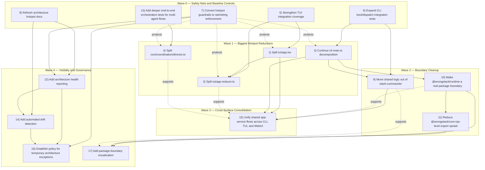

# 2026-07 Architecture Review Backlog

> **Historical issue set.** The canonical status mapping and dependency order now live in [`../../plans/architecture-refactor-task-graph-2026-07.md`](../../plans/architecture-refactor-task-graph-2026-07.md), governed by [`../../plans/adr-003-authority-first-refactor-program.md`](../../plans/adr-003-authority-first-refactor-program.md). The original issue details and dependency map below are retained as audit evidence; their former recommended order is not the active execution plan.

This folder splits the backlog generated from the 2026-07 end-to-end system review into one file per issue.

## Contents

1. [001-tui-app-split.md](001-tui-app-split.md)
2. [002-tui-app-reducer-split.md](002-tui-app-reducer-split.md)
3. [003-cli-main-decomposition.md](003-cli-main-decomposition.md)
4. [004-director-responsibility-split.md](004-director-responsibility-split.md)
5. [005-tui-integration-coverage.md](005-tui-integration-coverage.md)
6. [006-cli-boot-dispatch-tests.md](006-cli-boot-dispatch-tests.md)
7. [007-hotspot-guardrails-ratcheting.md](007-hotspot-guardrails-ratcheting.md)
8. [008-refresh-hotspot-docs.md](008-refresh-hotspot-docs.md)
9. [009-extract-cli-services-from-slash-commands.md](009-extract-cli-services-from-slash-commands.md)
10. [010-runtime-real-boundary.md](010-runtime-real-boundary.md)
11. [011-reduce-core-export-sprawl.md](011-reduce-core-export-sprawl.md)
12. [012-architecture-health-reporting.md](012-architecture-health-reporting.md)
13. [013-multi-agent-e2e-tests.md](013-multi-agent-e2e-tests.md)
14. [014-hotspot-drift-detection.md](014-hotspot-drift-detection.md)
15. [015-unify-shared-app-services.md](015-unify-shared-app-services.md)
16. [016-temporary-architecture-exceptions-policy.md](016-temporary-architecture-exceptions-policy.md)
17. [017-package-boundary-visualization.md](017-package-boundary-visualization.md)
18. [018-modularity-audit-and-plan.md](018-modularity-audit-and-plan.md) — Read-only audit with file-size, import-fan-in, cross-package matrix; adds 3 new findings (CLI→TUI/WebUI utility leak, kanban/manager.ts façade pattern, TUI panels/ feature split) and 5 proposed architectural decisions
19. [019-pr-00-clean-baseline.md](019-pr-00-clean-baseline.md) — Frozen clean-worktree baseline for the P0/P1 program, including gate classifications, build-order diagnosis, and exclusive file-ownership windows

## Recommended initial working order

1. 005 — TUI integration coverage
2. 001 — `tui/app.tsx` split
3. 002 — `tui/app-reducer.ts` split
4. 006 — CLI boot/dispatch integration tests
5. 003 — `cli-main.ts` decomposition

## Dependency map

**Legend:** solid arrows = dependency or strong sequencing; dashed arrows = support or enabling relationship

