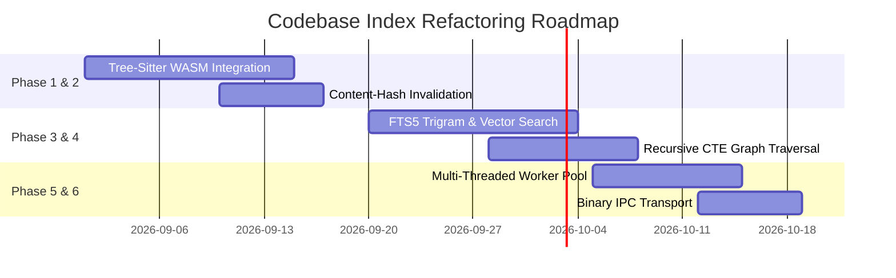

# Codebase Index Architecture & Comprehensive Refactoring Proposal

**Target System:** `WrongStack Codebase Index Service`  
**Package Location:** [`packages/tools/src/codebase-index/`](file:///D:/Codebox/PROJECTS/WrongStack/packages/tools/src/codebase-index)  
**Date:** August 2026  
**Status:** Proposal & Architectural Blueprint  

---

## Executive Summary

The **WrongStack Codebase Index** is a high-performance, multi-language symbol extraction, search, and dependency graph engine. It powers critical LLM tools (`codebase-search`, `codebase-incoming-calls`, `codebase-outgoing-calls`, `codebase-stats`), Code Atlas visualizer, TUI status indicators, and the MCP server interface (`codebase-index-mcp`).

While the current architecture delivers sub-millisecond query responses and robust IPC isolation via a detached SQLite project daemon, future scaling to 100,000+ file monorepos, multi-language polyglot environments, and semantic concept retrieval demands targeted refactoring.

This document presents an end-to-end architectural survey of the existing index service, isolates technical bottlenecks, and outlines a concrete 6-phase engineering refactoring roadmap.

---

## 1. Comprehensive Survey of Existing Architecture

The codebase index service is organized into seven distinct architectural layers:

```
┌──────────────────────────────────────────────────────────────────────────────────┐
│  Layer 7: Public Tool & API Interfaces                                          │
│  [codebase-search-tool.ts, codebase-incoming-calls-tool.ts, codebase-index-mcp]   │
└────────────────────────────┬─────────────────────────────────────────────────────┘
                             │
┌────────────────────────────▼─────────────────────────────────────────────────────┐
│  Layer 1 & 2: IPC Daemon, Process Mutex & Execution Dispatch                     │
│  [project-server.ts, project-server-client.ts, background-indexer.ts]           │
└────────────────────────────┬─────────────────────────────────────────────────────┘
                             │
┌────────────────────────────▼─────────────────────────────────────────────────────┐
│  Layer 3 & 4: Discovery, Pipeline Orchestration & Parser Dispatch               │
│  [indexer.ts, parser-dispatch.ts, ts-parser.ts, generic-parser.ts]              │
└────────────────────────────┬─────────────────────────────────────────────────────┘
                             │
┌────────────────────────────▼─────────────────────────────────────────────────────┐
│  Layer 5 & 6: Persistence, Schema & Dependency Graph Traversal                  │
│  [writer.ts, writer-schema.ts, schema.ts, writer-graph-reader.ts]                │
└──────────────────────────────────────────────────────────────────────────────────┘
```

### 1.1 IPC Server & Service Lifecycle ([`project-server.ts`](file:///D:/Codebox/PROJECTS/WrongStack/packages/tools/src/codebase-index/project-server.ts))
- **Election & Socket Primitive:** One detached process runs per resolved project index directory. OS-level socket/named-pipe binding acts as the election lock (`EADDRINUSE` causes secondary candidates to exit gracefully).
- **Security & Authorization:** Uses a random 128-bit hex `authToken` stored in an owner-only metadata file (`0600` permissions on `server.json`). Incoming requests must prove knowledge of the token to query or modify the index.
- **Client Lease & Idle Management:** Applies a 45-second heartbeat lease per connected socket. The daemon automatically shuts down after 5 minutes of inactivity (`WRONGSTACK_INDEX_SERVER_IDLE_MS`).
- **External Tree Watcher:** Owns and debounces project file events (`watchProjectTree`), consolidating file system updates across multiple open clients (TUI, WebUI, CLI, subagents).
- **In-Memory Caching:** Utilizes a `GenerationLruCache` keyed by index generation ID to serve query responses (search, stats, package/file/symbol graphs, incoming/outgoing call sites) instantly.

### 1.2 Execution Dispatch & Resilience ([`background-indexer.ts`](file:///D:/Codebox/PROJECTS/WrongStack/packages/tools/src/codebase-index/background-indexer.ts))
- **Process Mutex Chain:** Enforces a single promise-chain mutex (`withMutex`) for write operations to serialize SQLite writes and prevent WAL lock collisions.
- **Micro-Batching & Debounce:** Per-file edits are debounced over 400ms and aggregated using `setImmediate` event loop ticks into single multi-file index runs.
- **Circuit Breaker:** Monitored via [`circuit-breaker.ts`](file:///D:/Codebox/PROJECTS/WrongStack/packages/tools/src/codebase-index/circuit-breaker.ts). Repeated failures or timeouts open the circuit, failing fast with structured feedback rather than locking the worker.
- **Multi-Tier Execution Fallback:** Operations route through:
  1. Detached IPC Project Server (Production default)
  2. Worker Thread ([`worker.ts`](file:///D:/Codebox/PROJECTS/WrongStack/packages/tools/src/codebase-index/worker.ts))
  3. In-Process Inline Execution (Fallback for source-tree tests or constrained runtimes)

### 1.3 Discovery & Index Orchestrator ([`indexer.ts`](file:///D:/Codebox/PROJECTS/WrongStack/packages/tools/src/codebase-index/indexer.ts))
- **Fast Git Discovery:** Calls `git ls-files` and `git status` for root Git repositories to bypass thousands of recursive `fs.readdir` and `stat` calls.
- **Parallel Processing:** Executes parallel file `stat`, read, and parse phases using `Promise.allSettled`. Batch width dynamically scales with CPU parallelism (`resolveParallelBatch`).
- **Transaction Commit Batching:** Aggregates database writes into a single SQLite transaction (`commitBatch`) per batch of 20 files, reducing disk `fsync` operations by ~95%.
- **Post-Indexing Relation Pass:** Executes `resolveProjectRelations` to derive ecosystem manifests (`package.json`, `go.mod`, `Cargo.toml`), tag files with package labels, and resolve cross-file import specifiers (`ModuleResolver`).

### 1.4 Parser & Symbol Extraction Stack ([`parser-dispatch.ts`](file:///D:/Codebox/PROJECTS/WrongStack/packages/tools/src/codebase-index/parser-dispatch.ts))
- **Lazy Module Imports:** Compiler APIs (such as `@typescript/typescript6`, ~9MB JS / ~26MB heap) are dynamically imported via `import(...)` only when a file matching their extension is encountered.
- **First-Class AST Parsers:** TypeScript/JavaScript ([`ts-parser.ts`](file:///D:/Codebox/PROJECTS/WrongStack/packages/tools/src/codebase-index/ts-parser.ts)), Go ([`go-parser.ts`](file:///D:/Codebox/PROJECTS/WrongStack/packages/tools/src/codebase-index/go-parser.ts)), Python ([`py-parser.ts`](file:///D:/Codebox/PROJECTS/WrongStack/packages/tools/src/codebase-index/py-parser.ts)), Rust ([`rs-parser.ts`](file:///D:/Codebox/PROJECTS/WrongStack/packages/tools/src/codebase-index/rs-parser.ts)), JSON ([`json-parser.ts`](file:///D:/Codebox/PROJECTS/WrongStack/packages/tools/src/codebase-index/json-parser.ts)), and YAML ([`yaml-parser.ts`](file:///D:/Codebox/PROJECTS/WrongStack/packages/tools/src/codebase-index/yaml-parser.ts)).
- **Regex Fallback Extractor:** [`generic-parser.ts`](file:///D:/Codebox/PROJECTS/WrongStack/packages/tools/src/codebase-index/generic-parser.ts) and [`import-extractor.ts`](file:///D:/Codebox/PROJECTS/WrongStack/packages/tools/src/codebase-index/import-extractor.ts) extract recall-oriented symbols and import paths for secondary languages (C, C++, Java, C#, PHP, Ruby, Swift, Shell, SQL, Markdown, etc.).
- **Language Scoping:** `Ref.lang` stamps referencing languages into SQLite (`lang_family`), scoping symbol target resolution to prevent cross-language name collisions (e.g. `New()`, `main()`, `validate()`).

### 1.5 SQLite Storage & Schema ([`writer.ts`](file:///D:/Codebox/PROJECTS/WrongStack/packages/tools/src/codebase-index/writer.ts) & [`schema.ts`](file:///D:/Codebox/PROJECTS/WrongStack/packages/tools/src/codebase-index/schema.ts))
- **Database Location:** Stores SQLite databases out-of-tree under `~/.wrongstack/projects/<hash>/codebase-index/index.db`.
- **Engine & Pragmas:** `node:sqlite` (`DatabaseSync`) in WAL mode, using `repairMissingColumns()` for self-healing schema migrations without requiring full rebuilds on minor column additions.
- **FTS5 Integration:** `symbols_fts` virtual table using `unicode61` tokenizer, running native `MATCH` and `-bm25(symbols_fts)` ranking, backed by an in-process BM25 memory fallback for runtimes compiled without SQLite FTS5.

```sql
-- Schema Core Snapshot (schema version 4)
CREATE TABLE files (
  file TEXT PRIMARY KEY,
  lang TEXT NOT NULL,
  mtime_ms INTEGER NOT NULL,
  symbol_count INTEGER NOT NULL DEFAULT 0,
  last_indexed INTEGER NOT NULL,
  package TEXT NOT NULL DEFAULT ''
);

CREATE TABLE symbols (
  id INTEGER PRIMARY KEY,
  lang TEXT NOT NULL,
  kind TEXT NOT NULL,
  name TEXT NOT NULL,
  file TEXT NOT NULL,
  line INTEGER NOT NULL,
  col INTEGER NOT NULL,
  signature TEXT NOT NULL DEFAULT '',
  doc_comment TEXT NOT NULL DEFAULT '',
  scope TEXT NOT NULL DEFAULT '',
  text TEXT NOT NULL DEFAULT '',
  file_fk TEXT NOT NULL
);

CREATE TABLE refs (
  id INTEGER PRIMARY KEY,
  from_id INTEGER NOT NULL,
  to_name TEXT NOT NULL,
  to_id INTEGER,
  call_type TEXT NOT NULL,
  line INTEGER NOT NULL,
  lang TEXT NOT NULL DEFAULT '',
  module TEXT,
  to_file TEXT
);
```

---

## 2. Technical Evaluation & Bottleneck Analysis

| Area | Current Implementation | Limitation / Bottleneck | Refactoring Target |
|---|---|---|---|
| **Multi-Language Parsing** | Regex heuristics ([`generic-parser.ts`](file:///D:/Codebox/PROJECTS/WrongStack/packages/tools/src/codebase-index/generic-parser.ts)) for 30+ languages | High false-positive rate, struggles with multi-line signatures, macros, templates, and comments | WebAssembly `tree-sitter` universal AST parser |
| **Incremental Invalidation** | `mtimeMs` timestamp checking | Git branch switching, `touch`, or formatting updates trigger full re-parsing even when code content is byte-identical | Fast 64-bit content hashing (`xxHash64` / `BLAKE3`) |
| **Search Capabilities** | Keyword-exact BM25 / FTS5 search | Cannot find symbols by conceptual intent (e.g. searching "user authentication handler" won't match `verifySession()`) | Hybrid Retrieval: FTS5 Trigram + Vector Embeddings |
| **FTS Tokenization** | `unicode61` tokenization | CamelCase splitting handled in JS; substring/partial matches degrade to `LIKE '%query%'` table scans | SQLite FTS5 `trigram` tokenizer configuration |
| **Graph Traversals** | In-memory JS BFS loops ([`dead-code-scan.ts`](file:///D:/Codebox/PROJECTS/WrongStack/packages/tools/src/codebase-index/dead-code-scan.ts)) | High memory allocations, slow SQL-to-JS object marshaling for large dependency graphs | Native SQLite Recursive CTE (Common Table Expressions) |
| **IPC Transport** | Newline-delimited JSON text frames | JSON stringify/parse serialization CPU overhead on large payload responses (e.g., full graph queries) | Binary framing protocol (MessagePack / CBOR) |
| **Concurrency Scaling** | Single-threaded project server event-loop parsing | Dynamic import parse tasks for 50,000+ files can block server event loop turns | Dynamic Worker Thread Pool for initial bulk indexing passes |

---

## 3. Targeted Refactoring Architecture & Blueprint

```
                      REFACTORED ARCHITECTURE MAP
                      
        ┌──────────────────────────────────────────────────────────┐
        │        Binary IPC Frame (MessagePack / CBOR)            │
        └────────────────────────────┬─────────────────────────────┘
                                     │
        ┌────────────────────────────▼─────────────────────────────┐
        │   Project Server with Native Recursive CTE Graph Engine  │
        └──────┬─────────────────────┬──────────────────────┬──────┘
               │                     │                      │
 ┌─────────────▼────────────┐ ┌──────▼──────────────┐ ┌──────▼─────────────┐
 │ Content-Addressable Hash │ │ Universal AST via   │ │ Hybrid Search Engine│
 │ xxHash64 / BLAKE3        │ │ Tree-Sitter (WASM)  │ │ FTS5 Trigram + Vector│
 └──────────────────────────┘ └─────────────────────┘ └────────────────────┘
```

### Phase 1: WebAssembly Tree-Sitter Universal AST Extractor

#### Objective
Replace ad-hoc regular expressions in `generic-parser.ts` with a lightweight, multi-language WebAssembly Tree-Sitter parser (`web-tree-sitter`).

#### Key Architecture & Implementation Details
- Create `packages/tools/src/codebase-index/tree-sitter-parser.ts`.
- Pre-compile/bundle WASM language grammars for C, C++, Java, C#, PHP, Ruby, Swift, Kotlin, Go, Python, Rust, Elixir, and Shell.
- Implement a unified Tree-Sitter AST node visitor that extracts declaration signatures, scope chains, JSDoc/docstrings, and call references.

```typescript
// Proposed TreeSitterParser interface
import type { Language, Parser, SyntaxNode } from 'web-tree-sitter';
import type { FileSymbols, Symbol, Ref, SymbolLang } from './schema.js';

export class TreeSitterExtractor {
  private parser!: Parser;
  private grammarMap = new Map<SymbolLang, Language>();

  async initialize(): Promise<void> {
    // Lazy initialize WASM engine
  }

  async parse(file: string, content: string, lang: SymbolLang): Promise<FileSymbols> {
    const language = await this.loadGrammar(lang);
    this.parser.setLanguage(language);
    const tree = this.parser.parse(content);
    
    const symbols: Symbol[] = [];
    const refs: Ref[] = [];
    
    this.traverseNode(tree.rootNode, file, lang, symbols, refs);
    return { file, lang, symbols, refs, mtimeMs: Date.now() };
  }

  private traverseNode(
    node: SyntaxNode,
    file: string,
    lang: SymbolLang,
    symbols: Symbol[],
    refs: Ref[]
  ): void {
    // Universal query node mapping
  }
}
```

---

### Phase 2: Content-Addressable Incremental Invalidation (`content-hash.ts`)

#### Objective
Prevent redundant re-indexing triggered by `mtimeMs` updates when source code content has not changed.

#### Schema & Logic Modifications
1. Update [`writer-schema.ts`](file:///D:/Codebox/PROJECTS/WrongStack/packages/tools/src/codebase-index/writer-schema.ts) table definition:
   ```sql
   ALTER TABLE files ADD COLUMN content_hash TEXT NOT NULL DEFAULT '';
   CREATE INDEX IF NOT EXISTS idx_f_content_hash ON files(content_hash);
   ```

2. Update incremental checking in [`indexer.ts`](file:///D:/Codebox/PROJECTS/WrongStack/packages/tools/src/codebase-index/indexer.ts):
   - Fast 64-bit non-cryptographic hash (e.g. `xxhash64`) computed over the file content buffer.
   - If `existingMeta.content_hash === currentContentHash`, update `mtime_ms` in `files` and skip re-parsing entirely.

---

### Phase 3: Hybrid Search Engine (FTS5 Trigram + Vector Embeddings)

#### Objective
Enable both exact identifier matching (via SQLite FTS5 Trigram) and conceptual semantic search (via Vector Embeddings).

#### Implementation Details
1. **Trigram FTS5 Tokenizer Configuration:**
   Modify [`writer-schema.ts`](file:///D:/Codebox/PROJECTS/WrongStack/packages/tools/src/codebase-index/writer-schema.ts) to utilize the trigram tokenizer for sub-string and camelCase indexing without requiring table scans:
   ```sql
   CREATE VIRTUAL TABLE IF NOT EXISTS symbols_fts USING fts5(
     text,
     tokenize = 'trigram'
   );
   ```

2. **Vector Embedding Layer (`sqlite-vector` / Local Embeddings):**
   - Create `packages/tools/src/codebase-index/vector-search.ts`.
   - Store 384-dimensional dense vectors (`float32`) generated from symbol signature + docstrings using an ONNX runtime / fast-embed model.
   - Combine scores using **Reciprocal Rank Fusion (RRF)**:
     $$\text{RRF\_Score}(d) = \frac{1}{60 + \text{Rank}_{\text{BM25}}(d)} + \frac{1}{60 + \text{Rank}_{\text{Vector}}(d)}$$

---

### Phase 4: Native SQLite Recursive CTE Graph Engine

#### Objective
Offload graph traversal algorithms (incoming calls, outgoing calls, dead code detection) from JavaScript memory loops to native SQLite execution.

#### Implementation Details
Replace the in-memory BFS in [`dead-code-scan.ts`](file:///D:/Codebox/PROJECTS/WrongStack/packages/tools/src/codebase-index/dead-code-scan.ts) and [`writer-graph-reader.ts`](file:///D:/Codebox/PROJECTS/WrongStack/packages/tools/src/codebase-index/writer-graph-reader.ts) with SQL recursive queries:

```sql
-- Recursive Incoming Call Tree (Native SQL Execution)
WITH RECURSIVE incoming_tree(from_id, to_id, depth) AS (
  -- Anchor member: direct callers
  SELECT r.from_id, r.to_id, 1 AS depth
  FROM refs r
  WHERE r.to_id IN (SELECT id FROM symbols WHERE name = :symbolName)

  UNION ALL

  -- Recursive member: callers of callers
  SELECT r.from_id, r.to_id, it.depth + 1
  FROM refs r
  JOIN incoming_tree it ON r.to_id = it.from_id
  WHERE it.depth < :maxDepth
)
SELECT 
  s.id, s.name, s.kind, s.lang, s.file, s.line, s.signature,
  it.depth
FROM incoming_tree it
JOIN symbols s ON s.id = it.from_id
GROUP BY s.id
ORDER BY it.depth ASC, s.file, s.line;
```

---

### Phase 5: Scalable Multi-Threaded Parser Worker Pool

#### Objective
Ensure full initial re-indexing passes (`runStartupIndex`) do not block the Project Server's main event loop on large monorepos (50,000+ files).

#### Implementation Details
- Reintroduce an optimized Worker Pool manager (`parser-worker-pool.ts`).
- When total pending files $> 500$, spawn CPU-bound worker threads to perform file reading and Tree-Sitter AST parsing in parallel.
- Main thread receives parsed `FileSymbols[]` chunks and executes unified batch writes (`commitBatch`) into SQLite.

---

### Phase 6: Binary Frame Protocol & IPC Optimization

#### Objective
Reduce IPC serialization overhead between clients and the Project Server for massive payload exchanges.

#### Implementation Details
- Update [`project-server-protocol.ts`](file:///D:/Codebox/PROJECTS/WrongStack/packages/tools/src/codebase-index/project-server-protocol.ts).
- Introduce optional binary framing negotiation during the client handshake (`hello` frame).
- Swap JSON serialization for `MessagePack` (`@msgpack/msgpack`), cutting payload sizes by ~40% and payload encoding/decoding latency by ~60%.

---

## 4. Engineering Roadmap & Verification Matrix

### 4.1 Phase Execution Plan



### 4.2 Quality Assurance & Benchmark Verification Matrix

| Verification Target | Test Suite Location | Benchmark Target | Success Criteria |
|---|---|---|---|
| **AST Parse Accuracy** | `packages/tools/tests/codebase-index-multilang-relations.test.ts` | 40+ Languages | 0 false positives in multi-line C/C++/Java declarations |
| **Incremental Re-index Speed** | `packages/tools/tests/background-indexer.test.ts` | 10,000 files (mtime touched, code identical) | Index duration $< 100\text{ms}$ total |
| **Trigram Search Performance** | `packages/tools/tests/codebase-index.test.ts` | Substring query over 500,000 symbols | Query response $< 5\text{ms}$ |
| **Graph Traversal Latency** | `packages/tools/tests/codebase-index-calls.test.ts` | Depth-5 incoming call tree query | Query response $< 2\text{ms}$ |
| **Full Build Memory Ceiling** | Monorepo Synthetic Benchmark (50k files) | RSS Heap Consumption | Peak Memory $< 250\text{MB}$ |

---

## Conclusion & Next Steps

This refactoring plan systematically addresses the parser accuracy, incremental performance, search capability, and IPC bottlenecks of the WrongStack Codebase Index Service. Upon approval, Phase 1 (Tree-Sitter WASM integration) and Phase 2 (Content-Addressable Invalidation) can be implemented directly without breaking existing public API contracts.
