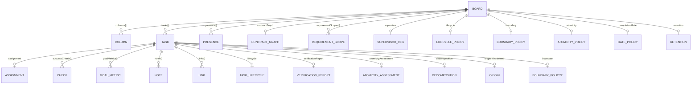
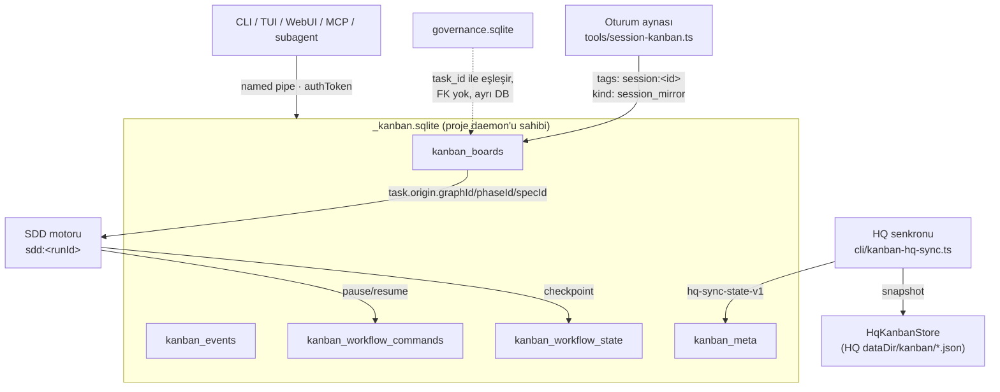

# Kanban Veritabanı Mimarisi ve İlişkiler

Bu belge Kanban alt sisteminin **kalıcılık katmanını** baştan sona anlatır: hangi
tablo neden var, hangi alan hangi ihtiyaç için eklendi, ne neyle ilişkili ve bu
ilişkilerin hangisi veritabanı tarafından zorlanıyor (cevap: hiçbiri — nedeni
aşağıda).

Üst seviye çalışma mantığı, kuyruk semantiği ve dispatch akışı için
[kanban-architecture.md](kanban-architecture.md); contract graph semantiği için
[kanban-contract-graph.md](kanban-contract-graph.md).

---

## 1. Tek cümlelik özet

Kanban'ın kalıcılığı **tek bir SQLite dosyasında, beş tabloda** durur; ancak
gerçek veri modelinin neredeyse tamamı `kanban_boards.payload` içindeki **tek bir
JSON belgesinde** yaşar. Yani SQLite bir *ilişkisel şema* değil, **revizyonlu,
işlemsel bir belge deposu** olarak kullanılır.

| Katman | Nerede | Ne tutar |
| --- | --- | --- |
| Fiziksel | `.wrongstack/kanbans/_kanban.sqlite` | 5 tablo, 3 açık indeks |
| Mantıksal | `kanban_boards.payload` (JSON) | Board, kolon, kart, atama, check, contract graph, presence… |
| Kontrol düzlemi | `kanban_workflow_*` tabloları | SDD/motor koşu durumu ve komut kuyruğu |
| Yan defterler | `governance.sqlite`, HQ JSON dosyaları | Doğrulama kanıtı, HQ senkron aynası |

---

## 2. Fiziksel katman

### 2.1 Dosya ve sahiplik

```
<projectRoot>/.wrongstack/
├── kanban-server.json          # daemon metadata + authToken (0600)
└── kanbans/
    ├── _kanban.sqlite          # TEK otorite
    ├── _kanban.sqlite-wal
    └── _kanban.sqlite-shm
```

- Dosya adı: `KANBAN_SQLITE_FILE = '_kanban.sqlite'`
  (`packages/kanban/src/server/sqlite-storage.ts:20`).
- Dizin: `getKanbanDir()` → `<projectRoot>/.wrongstack/kanbans`
  (`packages/kanban/src/storage.ts:35`).
- Daemon metadata'sı **kasten** bu dizinin dışındadır: `kanbans/` dizininin
  hiç `.json` dosyası içermemesi, eski JSON board deposundan çıkışın pinlenmiş
  testidir (`server/protocol.ts:173-178`).

**Proje başına tek yazar.** DB'yi yalnızca seçilmiş Kanban project-server süreci
açar; diğer tüm süreçler (CLI, TUI, WebUI, MCP, subagent) named pipe / unix
socket üzerinden IPC ile konuşur. Bu, projenin genel "proje başına TEK daemon +
IPC + SQLite" değişmeziyle aynıdır.

### 2.2 PRAGMA'lar

`initializeSchema()` (`sqlite-storage.ts:371-421`):

| PRAGMA | Değer | Neden |
| --- | --- | --- |
| `journal_mode` | `WAL` | Okuma yazmayı bloklamasın; append maliyeti düşsün |
| `synchronous` | `NORMAL` | WAL ile birlikte güvenli/hızlı denge |
| `foreign_keys` | `ON` | Açık — ama Kanban tablolarında **tanımlı FK yok** (§4.6) |
| `busy_timeout` | `5000` | Kısa süreli kilit çakışmalarında hata yerine bekleme |

### 2.3 Eşzamanlılık modeli

İki ayrı seviye var:

1. **Süreç içi seri hale getirme** — `exclusive()` (`sqlite-storage.ts:670`) tüm
   işlemleri tek bir promise kuyruğuna dizer. `DatabaseSync` senkron olduğu için
   bu, async mutator'ların (örn. `mutateBoard`) araya girmesini engeller.
2. **İşlem sınırı** — çok ifadeli her mutasyon `BEGIN IMMEDIATE` ile başlar,
   `COMMIT`/`ROLLBACK` ile kapanır. `writeBoard`, `deleteBoard`,
   `drainWorkflowCommands`, `writeWorkflowState`, `mutateBoard` ve legacy
   migrasyonu bu kalıbı kullanır.

Süreçler arası güvenlik ise şemadan değil, **tek sahiplikten** gelir.

---

## 3. Tablo tablo: ne, neden, nasıl

### 3.1 `kanban_boards` — otorite kayıt

```sql
CREATE TABLE kanban_boards (
  id         TEXT PRIMARY KEY,
  payload    TEXT NOT NULL,   -- normalize edilmiş KanbanBoard JSON'u
  revision   INTEGER NOT NULL,
  updated_at TEXT NOT NULL
);
```

| Alan | Ne için eklendi |
| --- | --- |
| `id` | `randomUUID()`; ayrıca **önek çözümlemesi** destekler (`LIKE 'pfx%' ESCAPE '\'`), birden çok eşleşmede `Ambiguous board id` fırlatır |
| `payload` | Board'un tamamı. Kolon/kart/atama ayrı tabloya bölünmedi çünkü her mutasyon zaten board bütününde atomik olmak zorunda |
| `revision` | **İyimser kilitleme sayacı.** `version`'dan (şema işareti) farklı; her başarılı yazımda +1 |
| `updated_at` | Legacy migrasyonda "hangisi daha yeni" kararı ve sıralama için |

**Stale-write tespiti.** `writeBoardUnlocked` `expectedRevision` alır; DB'deki
revizyon eşleşmezse `StaleWriteError` fırlatır (`sqlite-storage.ts:605-635`).
Böylece iki ajan aynı board'u aynı anda değiştirdiğinde ikincisi sessizce
üzerine yazmaz, hata alıp işlemi tekrarlar.

**No-op koruması.** `mutateBoard` mutator'dan önce ve sonra board'un
**SHA-256 parmak izini** alır; değişmemişse yazma tamamen atlanır
(`sqlite-storage.ts:333-369`). Bunun sebebi supervisor gibi yüksek frekanslı
çağrıcıların çoğu turda "onaracak bir şey yok" dönmesi: eskiden bu turlar da
revizyonu artırıp tüm board'u yeniden yazıyor, her yazım da tüm izleyicileri
uyandırıyordu. Parmak izi, tam JSON string'ini mutasyon boyunca bellekte tutmamak
için kullanılır (32 bayt vs. iki tam board kopyası).

**Boyut uyarısı.** `warnIfOversized` payload 512 KB'ı (`KANBAN_BOARD_SOFT_MAX_BYTES`)
aştığında `WRONGSTACK_KANBAN_BOARD_OVERSIZED` uyarısı basar — yalnızca eşiği
**geçerken**, her mutasyonda değil. Sebep sert ve sessiz: HQ tel kodlayıcısı tek
board kaydında 750 KB'ı reddeder, board da HQ'dan tek kelime etmeden kaybolur.

### 3.2 `kanban_events` — denetim defteri

```sql
CREATE TABLE kanban_events (
  seq      INTEGER PRIMARY KEY AUTOINCREMENT,
  board_id TEXT NOT NULL,
  payload  TEXT NOT NULL
);
CREATE INDEX idx_kanban_events_board_seq ON kanban_events(board_id, seq);
```

Append-only aktivite defteri. `KanbanEvent` payload'ı: `id`, `boardId`, `type`,
`ts`, `taskId?`, `actor?`, `sessionId?`, `before?`, `after?`, `correlationId?`,
`subagentId?`, `runTaskId?`, `note?`.

- `seq` toplam sıralamayı verir; indeks board bazlı okumayı ucuzlatır.
- **Rotasyon:** her `appendEvent` sonrası board başına sayım alınır; `10_000`
  (`EVENT_LOG_MAX_ENTRIES`) aşılırsa en yeni `5_000` (`EVENT_LOG_TRIM_TO`) hariç
  hepsi silinir. Sınırsız büyümeyi engellemek için eklendi.
- `sessionId` / `subagentId` / `runTaskId`, bir kart mutasyonunu onu yapan
  oturuma ve alt ajana bağlamak için eklendi — çok ajanlı koşularda "bunu kim
  yaptı" sorusunun tek cevabı.

### 3.3 `kanban_meta` — anahtar/değer yan defteri

```sql
CREATE TABLE kanban_meta (key TEXT PRIMARY KEY, value TEXT NOT NULL);
```

Board'a ait olmayan, ama Kanban'ın sahipliğinde kalması gereken küçük durumlar
için. Bugün kullanılan iki anahtar:

| Anahtar | Yazan | Ne için |
| --- | --- | --- |
| `legacy-json-v1` | `migrateLegacyFiles()` | Eski JSON/JSONL deposundan geçişin **commit edilmiş** işareti |
| `hq-sync-state-v1` | `packages/cli/src/kanban-hq-sync.ts:47` | HQ senkronunun board→revizyon defteri + tombstone'lar |

`hq-sync-state-v1` eskiden `kanbans/.hq-sync.json` dosyasıydı; migrasyon onu da
tabloya taşır (§6).

### 3.4 `kanban_workflow_commands` — süreçler arası komut kuyruğu

```sql
CREATE TABLE kanban_workflow_commands (
  seq        INTEGER PRIMARY KEY AUTOINCREMENT,
  workflow_id TEXT NOT NULL,
  command_id  TEXT NOT NULL,
  created_at  TEXT NOT NULL,
  type        TEXT NOT NULL,
  payload     TEXT,
  UNIQUE (workflow_id, command_id)
);
CREATE INDEX idx_kanban_workflow_commands_workflow_seq
  ON kanban_workflow_commands(workflow_id, seq);
```

- **Neden var:** SDD gibi motorların "pause / resume / cancel" komutlarının,
  görev durumuyla **aynı sahibe** ait dayanıklı bir kanaldan geçmesi gerekiyordu.
  Ayrı bir dosya/mailbox yerine aynı DB'ye alınması, komutun ve kart durumunun
  aynı işlem sınırında olmasını sağlar.
- **Idempotan enqueue:** `INSERT OR IGNORE` + `UNIQUE(workflow_id, command_id)`.
  Aynı komut iki kez gönderilirse ikincisi sessizce yutulur, `enqueued: false`
  döner.
- **Atomik drain:** `SELECT … ORDER BY seq LIMIT ?` ve aynı `BEGIN IMMEDIATE`
  içinde o `seq`'lerin `DELETE`'i. İki tüketici aynı komutu alamaz.

### 3.5 `kanban_workflow_state` — motor checkpoint'i

```sql
CREATE TABLE kanban_workflow_state (
  workflow_id TEXT PRIMARY KEY,
  revision    INTEGER NOT NULL,
  updated_at  TEXT NOT NULL,
  payload     TEXT NOT NULL
);
CREATE INDEX idx_kanban_workflow_state_updated ON kanban_workflow_state(updated_at DESC);
```

- `workflow_id` biçimi: `kanbanWorkflowId(engine, runId)` →
  **`<engine>:<runId>`** (`packages/kanban/src/workflow-commands.ts:14`).
  Bugünkü kullanıcılar: `sdd:<runId>` ve `sdd:session`.
- `listWorkflowStates(prefix)` `LIKE 'sdd:%' ESCAPE '\'` ile çalışır — indeks
  `updated_at DESC` üzerinde, çünkü listeleme her zaman "en son koşular"dır.
- `revision` burada da iyimser kilit: `expectedRevision` uyuşmazsa
  `StaleWriteError`.

---

## 4. Belge içi veri modeli (`kanban_boards.payload`)

Asıl "ilişkisel" model burada. Aşağıdaki her ok bir **yazılım seviyesinde**
yabancı anahtardır; SQLite'ın haberi yoktur.

### 4.1 Board → alt varlıklar



### 4.2 Kart ↔ kart ilişkileri (aynı board içinde)

| Alan | Hedef | Ne için eklendi |
| --- | --- | --- |
| `columnId` | `column.id` | Kartın hangi kolonda olduğu. Geçersizse `normalizeBoard` ilk kolona düşürür |
| `dependsOn[]` | `task.id` | **Yürütme DAG'ı.** Hazırlık (`ready`) hesabı ve `dependencyBlocked` kuyruğu bunun üzerinden |
| `parentTaskId` / `childTaskIds[]` | `task.id` | Atomik ayrıştırma hiyerarşisi. Composite kart doğrudan çalışılmaz, çocukların toplamıyla doğrulanır |
| `mergedIntoTaskId` / `mergedFromTaskIds[]` | `task.id` | Kart birleştirmenin geri izlenebilirliği |
| `chain.previousTaskId` / `chain.nextTaskId` + `chain.chainId` | `task.id` | Sıralı zincir; `enforceDependencies` ile `dependsOn`'a da yansıtılabilir |

> **Ayrım önemli:** `dependsOn` *yürütme sırası*, contract graph ise *ne
> optimize ediliyor / ne korunmalı* grafiğidir. Bilerek ayrı tutulmuşlardır.

### 4.3 Contract graph iç referansları

```
KanbanContractNode.taskId   → task.id
KanbanContractNode.checkId  → task.successCriteria[].id
KanbanContractNode.metricId → task.goalMetrics[].id
KanbanContractEdge.from/to  → node.id  |  "task:<taskId>"  (örtük uç)
```

Kenar uçlarının hem düğüm hem `task:<id>` olabilmesi, bir kartın kendisini
grafikte ayrı bir düğüm yaratmadan hedef/kaynak yapabilmek için eklendi.
`normalizeContractGraph` okumada `enforcement`/`state`/zaman damgalarını
doldurur, böylece eski board'lar yeni alanlar olmadan da geçerli kalır.

### 4.4 Atama, lease ve fencing

`KanbanAgentAssignment` üç ihtiyaç dalgasıyla büyüdü:

| Grup | Alanlar | Neden |
| --- | --- | --- |
| Kimlik/rota | `agentId`, `name`, `role`, `provider`, `model`, `modelRouting`, `fallbackProfile`, `fallbackModels`, `skills`, `tools`, `allowedCapabilities` | Modelin nereden geldiği **açıkça** yazılsın; boş provider/model'in "oturumu kullan" mı "unutuldu" mu belirsizliği kalksın |
| Kiralama | `leaseId`, `claimedAt`, `heartbeatAt`, `leaseExpiresAt`, `attempt`, `maxAttempts` | Ölü ajanın kartı sonsuza dek tutmaması; süresi dolan kiralamanın kurtarılabilmesi |
| Maliyet/kurtarma (Sprint 2) | `costCeilingUsd`, `retryPolicy`, `lastFailureKind` | `selectRecoveryMode`'un release/retry/fail kararını verilere dayandırması |

**Fencing token.** `KanbanEventContext.expectedLeaseId`,
`HeartbeatKanbanTaskAssignmentInput.expectedLeaseId` ve
`ReleaseKanbanTaskClaimInput.expectedLeaseId` — mutasyon yalnızca kartın güncel
`assignment.leaseId`'si eşleşiyorsa uygulanır, kontrol **board mutasyon kilidinin
içinde** yapılır. Bu olmadan, kartı kurtarılıp yeniden atanmış bir zombi ajan
canlı sahibin talebini silebiliyordu.

**Sprint 3 dayanıklılık:** `retryPolicy` ve `costCeilingUsd` ayrıca *task*
seviyesinde de tutulur. Sebep: `assignment` claim/release döngüsünde silinir,
politika ise kartla birlikte kalmalıdır.

### 4.5 Yaşam döngüsü, kapı ve doğrulama

```
KanbanBoardLifecyclePolicy.mode = 'legacy' | 'managed'
  └─ columns: { backlog, todo, running, review, done }  → column.id'lere işaret eder
KanbanTaskLifecycle
  ├─ currentStage, stageEnteredAt
  └─ history[]: KanbanLifecycleTransition (from, to, at, actor, action, comment, attachment)
```

- Rollerin **açıkça** kolon id'lerine bağlanması, kolon başlığından ya da kart
  durumundan çıkarım yapmanın güvenilmez olması yüzünden eklendi.
- `autoAccept` (varsayılan: açık): geçen doğrulama kartı tek başına Done'a alsın
  mı? `false` yapıldığında kart Review'da insanı bekler. **Kapıyı asla
  gevşetmez** — başarısız veya eksik verdict hiçbir ayarla Done'a geçemez.
- `KanbanCompletionGatePolicy.enforcement`: `strict` (managed varsayılan) /
  `soft` (legacy: rapor yazılır ama engellenmez) / `off` (kaynağı zaten
  doğrulamış ayna board'lar, örn. SDD).
- `verificationReport` **değişmez**dir ve board mutasyonuyla **aynı işlemde**
  yazılır; kısmen yazılmış bir rapor mümkün değildir.

### 4.6 Presence — board içinde tutulan oturum izi

`KanbanBoardPresence`: `id` (session+agent çifti), `sessionId`, `agentId`,
`agentName?`, `taskId?`, `runTaskId?`, `firstSeenAt`, `lastSeenAt`,
`activeUntil`, `active`. TTL varsayılanı 2 dakika
(`DEFAULT_KANBAN_PRESENCE_TTL_MS`). Okuyucular `active`'i `activeUntil`'den
yeniden hesaplar — saat kayması olan sürecin "canlı" görünmesini engeller.

### 4.7 Neden FK yok?

`PRAGMA foreign_keys = ON` açık, ama Kanban tablolarında tek bir `REFERENCES`
yok. Sebep basit: **ilişkilerin tamamı JSON belgesinin içinde**, satırlar arasında
değil. `kanban_events.board_id` tek gerçek satır-arası referanstır ve FK yerine
`deleteBoard` içinde elle temizlenir — silme, aynı `BEGIN IMMEDIATE` işleminde
önce olayları sonra board'u siler (`sqlite-storage.ts:156-175`). Buna karşılık
`governance.sqlite` **gerçek** FK ve append-only trigger'lar kullanır (§5.3);
oradaki veri satır-ilişkiseldir.

---

## 5. Dış sistemlerle ilişkiler



### 5.1 SDD ↔ workflow tabloları

- `packages/sdd/src/sdd-lifecycle.ts` koşu snapshot'ını
  `kanbanWorkflowId('sdd', runId)` altında `kanban_workflow_state`'e yazar.
- `packages/sdd/src/kanban-sdd-session.ts` aktif oturum işaretini `sdd:session`
  altında tutar.
- `packages/sdd/src/start-sdd-run.ts` `drainKanbanWorkflowCommands` ile kontrol
  komutlarını çeker.
- `packages/webui-server/src/server/sdd-board-ws-handler.ts` aynı workflowId ile
  WebUI'ya yayar.
- Ters yön: kartın `origin` alanı (`system`, `graphId`, `phaseId`, `taskId`,
  `specId`, `specRequirementId`) kartı üreten grafiğe geri işaret eder.
  `specRequirementId` **spec'in kendisi değil**, spec içindeki gereksinimdir.

### 5.2 Oturum aynası (session mirror)

`packages/tools/src/session-kanban.ts` her oturum için bir board üretir:

- `tags: ['session-work', 'session:<id>']`, `generatedBy: 'session-kanban:<id>'`,
  `kind: 'session_mirror'`,
  `retention: { mode: 'archive_after_ttl', ttlMs: 7 gün }`.
- `normalizeBoardKind()` (`storage.ts:650`) `kind` alanı yokken bile bu etiket ve
  `generatedBy` deseninden türü **geriye dönük** çıkarır — `kind` eklenmeden önce
  yazılmış board'lar da doğru sınıflansın diye.
- Ayrılan oturumun boş aynası silinir; aksi halde proje görünümlerinde tarihsel
  yinelenmiş iş birikir.

### 5.3 Governance — ayrı DB, satır-ilişkisel

`governance.sqlite` Kanban'dan **tamamen ayrı** bir dosyadır ve karşıt bir tasarım
tercihi gösterir: gerçek FK'lar, `CHECK` kısıtları ve append-only trigger'lar.

| Tablo | Anahtar alanlar | Kanban bağı |
| --- | --- | --- |
| `governance_events` | `task_id`, `revision`, `UNIQUE(task_id, revision)` | `task_id` = Kanban kart id'si |
| `governance_command_receipts` | `command_id` PK, `task_id` | aynı |
| `governance_observations` | `project_id`, `task_id?` | aynı |
| `governance_verification_runs` | `run_id` PK, `task_id`, `contract_hash` | aynı |
| `governance_verification_leases` | `run_id` → runs (FK), `lease_id` PK | doğrulama kiralaması |
| `governance_verification_lease_consumptions` | `lease_id` → leases (FK, UNIQUE) | tek kullanım garantisi |
| `governance_workspace_snapshots` | `UNIQUE(project_id, revision)` | çalışma alanı manifest'i |

`governance_events`, `..._runs`, `..._leases` üzerinde `BEFORE UPDATE/DELETE`
trigger'ları `RAISE(ABORT, '… is append-only')` der. Kanban tarafında böyle bir
koruma yoktur çünkü Kanban kaydı **değişebilir belge**, governance kaydı ise
**kanıt defteridir**.

### 5.4 HQ senkronu

- Yerel taraf: `hq-sync-state-v1` anahtarı altında
  `{ boards: { <id>: { revision, updatedAt } }, tombstones: { <id>: … } }`.
- Tombstone saklama süresi 30 gün (`KANBAN_TOMBSTONE_RETENTION_MS`); süresi
  dolan tombstone hem kendisini hem `boards` girdisini siler.
- Uzak taraf: `HqKanbanStore` (`packages/core/src/hq/kanban-store.ts`) HQ'nun
  kendi `dataDir/kanban/<projectId>.json` dosyalarına yazar, revizyon sonra zaman
  damgasıyla birleştirir — eski yazar asla kazanmaz.
- Yayın başına en fazla 50 board okunur (`MAX_BOARDS_PER_PUBLISH`), snapshot
  payload'ı 512 KB ile sınırlıdır (HQ WS çerçeve limiti 1 MiB).

---

## 6. Legacy migrasyon (tamamlandı, ama kod duruyor)

`migrateLegacyFiles()` (`sqlite-storage.ts:450-568`) her açılışta çalışır ve
`kanbans/` dizininde şunları arar:

| Kaynak | Hedef |
| --- | --- |
| `<boardId>.json` | `kanban_boards` (revizyon/updated_at karşılaştırmalı upsert) |
| `<boardId>.events.jsonl` | `kanban_events` (event `id` ya da payload SHA-256 ile tekilleştirilir) |
| `.hq-sync.json` | `kanban_meta['hq-sync-state-v1']` |

Üç tasarım kararı dikkat çeker:

1. **Dosya silme COMMIT'ten sonra.** Parse/insert/işlem hatası, her legacy kaynağı
   teşhis ve tekrar için yerinde bırakır.
2. **Upsert koşullu:** yalnızca `excluded.revision > mevcut` ya da revizyon eşit
   ve `updated_at` daha yeniyse üzerine yazar.
3. **İşaret commit'li:** `legacy-json-v1` anahtarı yazıldıktan sonra bile dizinde
   legacy dosya varsa migrasyon tekrar çalışır (temizlik hatası bir sonraki
   açılışta yeniden denenir).

---

## 7. Tutarlılık değişmezleri

| Değişmez | Nerede zorlanır |
| --- | --- |
| Board'un tek yazarı proje daemon'udur | `runtimeStorage()` → IPC istemcisi; `authToken` `kanban-server.json`'dan, `hello` çerçevesinden **değil** |
| `revision` her gerçek yazımda tam olarak +1 artar | `mutateBoard` / `writeBoardUnlocked` |
| Eşleşmeyen revizyon = `StaleWriteError`, sessiz üzerine yazma yok | `sqlite-storage.ts:610`, `storage.ts:435` |
| Mutator hiçbir şeyi değiştirmediyse yazma yapılmaz | SHA-256 parmak izi karşılaştırması |
| Board silinince olayları da silinir, aynı işlemde | `deleteBoard` |
| Kiralama sahipliği board kilidinin içinde doğrulanır | `expectedLeaseId` fencing |
| `version` şema işareti, `revision` mutasyon sayacı — karıştırılmaz | `types.ts:793-798` |
| IPC operasyon adı açık allowlist'tir (75 operasyon) | `KANBAN_DOMAIN_OPERATIONS` |
| `projectRoot` istemciden **asla** kabul edilmez | `protocol.ts:204-209` |

---

## 8. Bu projedeki canlı ölçüm (2026-08-11)

`.wrongstack/kanbans/_kanban.sqlite` üzerinde doğrudan sorgu:

| Tablo | Satır |
| --- | --- |
| `kanban_boards` | 1 (1.117 bayt, revision 1, `kind: session_mirror`) |
| `kanban_events` | 0 |
| `kanban_meta` | 2 |
| `kanban_workflow_commands` | 0 |
| `kanban_workflow_state` | 0 |

Dosya boyutları: `_kanban.sqlite` **12 MB**, `-wal` **4,8 MB**.

**İki gözlem** (rapor kapsamı; düzeltme yapılmadı):

1. **`hq-sync-state-v1` satırı 725.803 bayt** — 3.072 board girdisi ve 3.071
   tombstone içeriyor, oysa canlı board sayısı 1. Bu tek satır her yayın
   döngüsünde (`readState`, `kanban-hq-sync.ts:174`) ve her uzak uygulamada
   (`:334`) baştan sona JSON olarak parse ediliyor; değişiklik olduğunda ise
   725 KB'lık tek satır tümüyle yeniden yazılıyor. Girdiler 30 günlük tombstone
   saklama süresiyle eninde sonunda düşüyor, ama tavan yok: silinen board sayısı
   30 gün içinde ne kadar artarsa satır o kadar büyüyor.
2. **12 MB dosya / 1,1 KB canlı veri** — silinen board'lardan kalan sayfalar
   freelist'te duruyor. Chronicle tarafında benzer bir durum için kota ölçümünün
   dosya boyutu yerine canlı bayta çevrilmesi gerekmişti; Kanban'da böyle bir
   kota yok, dolayısıyla bu şu an yalnızca disk kullanımı.

---

## 9. Hızlı referans: dosya haritası

| Konu | Dosya |
| --- | --- |
| Şema, işlemler, migrasyon | `packages/kanban/src/server/sqlite-storage.ts` |
| Backend arayüzü | `packages/kanban/src/storage-backend.ts` |
| Yol/normalize/legacy codec | `packages/kanban/src/storage.ts` |
| IPC tel protokolü, allowlist | `packages/kanban/src/server/protocol.ts` |
| Daemon metotları | `packages/kanban/src/server/project-server.ts` |
| Uzak istemci | `packages/kanban/src/server/remote-storage.ts` |
| Çekirdek tipler | `packages/kanban/src/types.ts` |
| Operasyon girdi/çıktı tipleri | `packages/kanban/src/types-operations.ts` |
| Contract graph tipleri | `packages/kanban/src/types-contract-graph.ts` |
| Domain operasyon allowlist'i | `packages/kanban/src/domain-operations.ts` |
| Workflow id üretimi | `packages/kanban/src/workflow-commands.ts` |
| HQ senkronu | `packages/cli/src/kanban-hq-sync.ts` |
| Oturum aynası | `packages/tools/src/session-kanban.ts` |
| Governance defterleri | `packages/governance/src/event-store.ts`, `verification-ledger-store.ts` |
