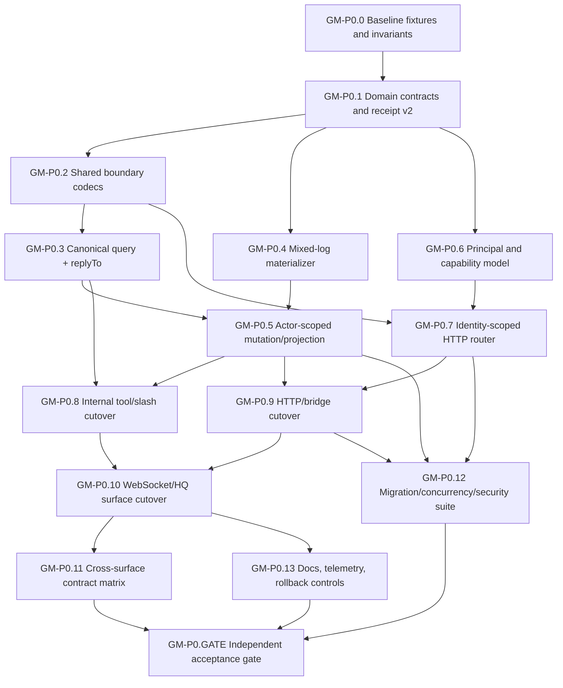

# Global Mailbox P0 Contract Repairs — Software Design Document

**Spec ID:** `global-mailbox-p0-contract-repairs-v1`  
**Version:** `1.0.0-draft`  
**Created:** 2026-07-26  
**Status:** Draft — ready for maintainer review  
**Template:** SDD refactor/security migration  
**Owner:** Core Coordination + CLI/WebUI Server maintainers  
**Task graph:** [`global-mailbox-p0-contract-repairs.task-graph.json`](global-mailbox-p0-contract-repairs.task-graph.json)

---

## 1. Overview

### 1.1 Problem

Global Mailbox exposes one project-scoped messaging system through direct core calls, `mail_send`, `mail_inbox`, the low-level `mailbox` tool, slash commands, the standalone HTTP bridge, WebSocket handlers, and HQ. Four P0 contract defects prevent these surfaces from being treated as one reliable protocol:

1. **Completion is message-global.** A single `completed` bit can suppress a broadcast, base-alias message, or session broadcast for every recipient after one recipient completes it.
2. **Boundary validation is duplicated.** Send, query, acknowledgement, registration, and action rules drift between core, tools, HTTP, WebSocket, HQ, and slash-command adapters.
3. **`replyTo` is declared but not honored by `GlobalMailbox.query()`.** Callers cannot reliably poll or retrieve direct replies using the public query contract.
4. **HTTP authorization is bridge-wide rather than identity-scoped.** Possession of one bearer token authorizes the bridge, while caller-controlled body fields select `from`, `readerId`, and registration identities.

### 1.2 Goal

Deliver one authoritative mailbox contract in which:

- every read/completion decision is evaluated for a trusted actor;
- fan-out messages preserve independent recipient progress;
- all public boundaries use shared codecs and equivalent semantic validation;
- `replyTo` filtering works on every query-capable surface;
- HTTP actors and capabilities come from authenticated principals, not request-body claims;
- existing JSONL mailboxes and loopback clients migrate without destructive rewriting or message loss.

### 1.3 Non-goals

This P0 does **not**:

- replace JSONL with SQLite;
- add durable SSE replay, cursor pagination, attachments, full-text search, claim leases, retries, or dead letters;
- redesign the WebUI/HQ mailbox experience beyond fields required for contract parity;
- add remote multi-host replication;
- reinterpret old message type semantics beyond enforcing the existing canonical rules consistently.

### 1.4 Design principles

1. **Authenticated actor, untrusted payload.** Identity and authorization are resolved before payload decoding.
2. **Immutable message, actor-scoped receipt.** Message content is shared; read/completion/outcome state belongs to a recipient actor.
3. **One codec per boundary object.** Every transport delegates to the same parser and semantic validator.
4. **Append-only migration.** Existing `_mailbox.jsonl` files are read in place; migration never rewrites history merely to upgrade the schema.
5. **Compatibility is explicit and temporary.** Legacy projections and bearer-token mode have named gates, telemetry, rollback, and removal criteria.
6. **Fail closed at trust boundaries.** Missing principals, invalid capabilities, actor overrides, and malformed records do not silently broaden access.

---

## 2. Baseline and Authority Map

| Concern | Current authority | P0 authority |
|---|---|---|
| Message and receipt types | `mailbox-types.ts` + ad hoc transport types | `mailbox-types.ts` domain types + shared boundary codecs |
| Send semantic validation | `resolveSendType*()` on selected surfaces | shared send codec called by every public send path and the storage boundary |
| Query validation | per-tool/per-router field extraction | shared query codec with trusted actor context |
| Completion | `MailboxMessage.completed` global projection | actor-scoped receipt state; legacy global projection retained for old records only |
| Reply lookup | declared `MailboxQuery.replyTo`, not applied by GlobalMailbox | exact-match `replyTo` predicate in the canonical query engine and every adapter |
| HTTP identity | one bridge bearer token + body-selected actor | authenticated `MailboxPrincipal`; actor fields derived server-side |
| Legacy HTTP token | implicit full bridge authority | explicit loopback operator compatibility mode with warning telemetry |

---

## 3. Requirements

### Critical

#### R1 — Recipient-scoped completion

`[critical][functional]` New mailbox writes persist read/completion/outcome state per trusted actor, and one recipient completing a fan-out message cannot complete it for another recipient.

**Acceptance criteria**

- Given a project broadcast delivered to two eligible actors, when actor A completes it, then actor B still receives it as incomplete and actionable.
- Given a direct message to actor A, when actor A completes it, then actor A no longer receives it from `incompleteOnly` queries.
- Given two completion receipts with different actors and outcomes, both receipts survive reload and retain their own timestamps/outcomes.
- Given an acknowledgement whose claimed actor differs from the trusted actor, the operation is rejected before persistence.

#### R2 — Actor-aware mailbox projections

`[critical][functional]` Query, check, unread-count, acknowledgement, compaction, HQ summaries, and UI adapters must not use a global completion projection where an actor-specific decision is required.

**Acceptance criteria**

- Actor-facing APIs expose `readByMe`, `completedByMe`, and `actionRequiredForMe` (or equivalent typed fields) derived from trusted actor context.
- Actor-agnostic administrative views expose aggregate receipt counts/states without pretending they are the selected actor's state.
- Auto-compaction cannot remove a v2 fan-out message merely because one eligible actor completed it.
- Leader-only audience filtering continues to use trusted identity/role information.

#### R3 — Backward-compatible receipt migration

`[critical][functional]` Existing message lines and `AckRecord` lines remain readable without destructive in-place migration.

**Acceptance criteria**

- Existing `readBy` maps become recipient read receipts in the materialized view.
- **V1 completion classification:** a v1 acknowledgement line with `completed: true` is reinterpreted according to the *original* recipient form of its target message at the time of the ack, NOT according to `readerId` alone:
  - **Direct exact-recipient message** with a known single recipient: completion migrates to actor-scoped state for that recipient (or `readerId` if it matches).
  - **Alias, session, or broadcast message** (`to` is `*`, a base alias, or `@session:*`): completion is classified as `legacyGlobalCompletion` regardless of `readerId` presence, because the original semantic was message-global. Only read receipts (not completion) migrate to the `readerId` actor.
- Historical globally completed fan-out messages retain a `legacyGlobalCompletion` compatibility projection so an upgrade does not re-flood already-finished work.
- New writes never create new legacy-global completion state.
- **Receipt fold algebra:** v2 receipt records combine by last-write-wins per field, keyed on `(messageId, actorId)`. Completion is monotonic upward (once `true`, it cannot revert to `false` through a new receipt unless an explicit reopen/restore record is written). Read timestamps use first-write-wins (earliest read is preserved). Outcome uses last-write-wins. Delete/restore use last-write-wins with `deleted` as the winning state when timestamps tie. Duplicate records (same `messageId`, `actorId`, `timestamp`) are idempotent no-ops.
- **Compaction eligibility for fan-out:** actor receipts alone cannot make unsnapshotted fan-out mail purgeable through the "read by all" pass, because the set of eligible actors changes over time and lazy materialization means some eligible recipients may never have a receipt. Fan-out retention uses TTL/expiry and admin purge policy, not read-by-all compaction.
- **Delete semantics:** soft-delete and restore remain message-level administrative operations, not actor-scoped receipt fields. The v2 receipt record does NOT carry `deleted`/`deletedBy`; those remain on the message projection as today. Actor-scoped "hide for me" is out of scope for P0.
- Mixed v1/v2 JSONL files survive parse, append, compaction, close, and reopen with no lost messages or receipts.
- **Writer-version fence:** once any v2 receipt record is appended to a mailbox file, previous-version writers and compactors MUST be prevented from mutating that file. The fence is implemented via a version marker (e.g., a `__mailboxVersion: 2` sentinel line or a sidecar file). An old process that encounters the marker MUST refuse mutation operations (send, ack, softDelete, restore, purge, compact, clearAll) and log a structured error. Rollback to a previous binary is an offline, exclusive operation requiring a verified backup — not a concurrent old/new process mix.
- **Rollback dual-write format:** new v2 receipts dual-write a minimal backward-readable legacy projection ONLY for read receipts (appending to `readBy`). New v2 fan-out completion NEVER writes a legacy global `completed: true` projection. This prevents an old compactor from collapsing actor-scoped completion back into global state. The exact wire format is: v2 receipt line as `{"__mailboxReceipt":2,...}` followed by an optional v1-compatible `{"__ack":true,...,"read":true,...}` line for read-only backward compatibility (no `completed` field on fan-out compatibility acks).

#### R4 — Shared boundary codecs

`[critical][functional]` Send, query, acknowledgement, check, registration, and action inputs use shared structural and semantic codecs across every public transport.

**Acceptance criteria**

- The same valid payload normalizes to equivalent domain input through tool, HTTP, WebSocket, HQ, and slash adapters.
- The same invalid payload produces the same stable error code and field path on every untrusted boundary.
- **Unknown-field policy:** mutation/command inputs (send, ack, register, heartbeat, delete, restore, clear, purge) REJECT unknown fields. Query inputs tolerate unknown fields by ignoring them (forward-compatibility for read-only clients). This policy is identical across all surfaces.
- Domain methods do not accept unchecked untrusted payload objects.
- **Storage-boundary enforcement:** `GlobalMailbox.send()` and all mutation methods call the canonical `validateSendType()` / shared codec validation internally, so invalid type/recipient combinations are rejected even through direct typed calls that bypass transport adapters.
- **Actor-bound service methods:** every sensitive operation accepts a trusted actor context, not just queries. The P0 introduces actor-bearing methods: `sendFor(actor, input)`, `ackFor(actor, input)`, `softDeleteFor(actor, mailId)`, `restoreFor(actor, mailId)`, `registerFor(actor, input)`, `heartbeatFor(actor, input)`. Legacy actor-ambiguous methods (`send(input)`, `ack(input)`, etc.) become explicitly internal/admin-only and are deprecated for external use.

#### R5 — Exact `replyTo` filtering

`[critical][functional]` `MailboxQuery.replyTo` performs an exact parent-ID match in `GlobalMailbox.query()` and is carried by every query-capable surface.

**Acceptance criteria**

- Given replies to two parent IDs, querying parent A returns only direct replies to A.
- An empty `replyTo` value follows one documented rule and behaves identically on all surfaces.
- `replyTo` composes correctly with sender, recipient, type, priority, session, deletion, actor visibility, and limit filters.
- HTTP and low-level tool query schemas expose the field and validate it with the shared codec.

#### R6 — Authenticated mailbox principals

`[critical][security]` HTTP authorization resolves a typed principal containing project, identity, role/kind, capabilities, trusted aliases/session, and authentication mode.

**Acceptance criteria**

- Missing or invalid credentials return the existing consistent unauthorized error shape.
- A principal is project-bound and cannot select another project mailbox through body fields.
- **Capability matrix:** capabilities are deny-by-default and include fine-grained scopes:

  | Capability | Authorizes |
  |---|---|
  | `mail.send.informational` | Send note, btw, result, status, broadcast |
  | `mail.send.actionable` | Send ask, assign, review (also requires `mail.send.informational`) |
  | `mail.send.directive` | Send steer (also requires `mail.send.actionable`) |
  | `mail.read.self` | Query/check messages visible to this principal |
  | `mail.read.all` | Administrative query of all messages (implies `mail.read.self`) |
  | `mail.ack.self` | Acknowledge messages for this principal only |
  | `mail.events.self` | Subscribe to SSE events filtered to this principal's visibility |
  | `mail.events.all` | Subscribe to unfiltered SSE (implies `mail.events.self`) |
  | `mail.presence.register.self` | Register agent/client identity |
  | `mail.presence.heartbeat.self` | Update presence heartbeat |
  | `mail.presence.deregister.self` | Deregister presence |
  | `mail.presence.read` | List agents/clients |
  | `mail.retention.purge` | Purge stale messages |
  | `mail.retention.clear` | Clear all messages |
  | `mail.admin.receipts` | View aggregate receipt state across actors |

  Capability implication rules: `mail.read.all ⇒ mail.read.self`; `mail.events.all ⇒ mail.events.self`; `mail.send.directive ⇒ mail.send.actionable ⇒ mail.send.informational`. External principals can never receive `control` send capability — it is reserved for runtime use only.

- **Trusted principal claims:** the principal carries `actorId`, `sessionId?`, and `recipientAliases: ReadonlySet<string>` (base aliases this principal may consume). These are issued by trusted runtime code or credential provisioning, not decoded from request bodies. Self-query derives all eligible recipient forms exclusively from these claims.
- The router receives the resolved principal and does not infer authorization from untrusted body fields.
- Principal identity and capability decisions are available to structured audit/diagnostic events without logging tokens.
- **Credential lifecycle:** credentials have `credentialId` (distinct from secret), `issuedAt`, `expiresAt`, `status`, `principal`, `project`, `capabilities`, and optional `notBefore`. Secret material is stored as a keyed hash/verifier at rest (not plaintext) using existing secret facilities. Rotation uses a bounded overlap window. Revocation is atomic and checked on every request including open SSE streams. Maximum lifetime is bounded by principal kind (agents: 7 days; operators: 24h; services: 30 days). Audit events are emitted for issue, rotate, revoke, expire, and failed use.
- **Rate-limit key:** uses `credentialId` or a keyed hash, never the raw secret token.

#### R7 — Server-derived actors and capability enforcement

`[critical][security]` New HTTP mode derives `from`, `readerId`, `agentId`, client identity, and trusted role/audience decisions from the authenticated principal.

**Acceptance criteria**

- Body-supplied actor fields that disagree with the principal are rejected with `FORBIDDEN` or a validation error; they are never persisted.
- A self-read credential cannot query all mail, acknowledge another actor's delivery, register another identity, or perform clear/purge/manage operations.
- An operator credential can perform only its declared administrative capabilities.
- `readerRole` is never trusted from an external request body.
- Reserved internal identities remain unavailable to external principals unless explicitly issued by trusted runtime code.
- **Transport security policy:** non-loopback identity-token mode MUST require encrypted transport (native HTTPS, mTLS, or explicitly configured trusted TLS termination). Startup MUST fail closed when a non-loopback bind uses bearer authentication without verified encrypted transport. An unsafe override is separate from the production path, prominently warned, and ineligible for security-gate approval. Forwarded-protocol headers are never trusted unless the immediate proxy is explicitly configured as trusted.
- **Query-string tokens banned:** `?token=` authentication is rejected for all mailbox routes. Credentials are accepted only via `Authorization` header.
- **SSE authorization:** SSE subscriptions require an explicit `mail.events.self` or `mail.events.all` capability. Every event is filtered against the authenticated principal's visibility before writing to the response stream. Events do not contain message bodies or audience metadata beyond what the principal is authorized to see. Streams are closed or reauthorized when credentials expire, rotate, or are revoked.
- **Response privacy:** `ActorMailboxMessage` (self-facing responses) does NOT extend `MailboxMessageProjection` — it contains only `readByMe`, `completedByMe`, `actionRequiredForMe`, `myOutcome?`, and standard message fields without aggregate `recipientState`. Aggregate receipt state is exposed only through a separate administrative projection requiring `mail.admin.receipts` or `mail.read.all`.
- **Cross-principal enumeration resistance:** `NOT_FOUND` (not `FORBIDDEN`) is returned when an actor attempts to ack/delete/restore an invisible message, so the error does not disclose message existence. Visibility is always checked before any target-message operation.

#### R8 — Explicit legacy bearer compatibility mode

`[critical][security]` Existing bridge-token clients remain operable during rollout without silently preserving unrestricted remote authority.

**Acceptance criteria**

- Legacy mode is explicit in configuration and represented as a named `legacy-operator` principal.
- Legacy mode defaults to loopback-only; non-loopback startup fails closed unless identity-scoped auth with encrypted transport is configured or an explicit unsafe override is approved.
- Every legacy-auth request increments a diagnostic counter and emits a rate-limited structured warning without exposing the token.
- Documentation includes credential migration, rollback, and the release/removal gate.
- **Mode mutual exclusivity:** authentication modes (identity-token and legacy-operator) are mutually exclusive per listener unless explicitly operating a separate migration endpoint. Credential formats are disjoint (different namespaces/prefixes). If an identity credential is recognized but invalid, expired, wrong-project, or revoked, the router MUST NOT fall back to legacy authentication. Rollback from identity mode to legacy requires authenticated configuration change plus restart. Mode changes emit an audit event.
- **Downgrade test coverage:** tests verify that expired, revoked, malformed, and wrong-project identity credentials are rejected without legacy fallback.

### High

#### R9 — Cross-surface contract matrix

`[high][non-functional]` A table-driven suite proves parity across direct core, thin tools, low-level tool, HTTP router, WebSocket handlers, HQ gateway, and slash-command adapters.

**Acceptance criteria**

- Fixtures cover every supported field, default, alias, type/recipient rule, actor override, query filter, and error class.
- Each fixture declares which surfaces apply; unsupported surface exceptions require an explicit reason.
- Tests assert zero storage side effects for rejected requests.
- Existing mailbox regression suites remain green.

#### R10 — Migration observability and rollback

`[high][non-functional]` Operators can detect compatibility usage, migration errors, and actor-state drift before legacy behavior is removed.

**Acceptance criteria**

- Diagnostics expose v1 records read, v2 receipts read/written, legacy-global completions projected, legacy-auth requests, forbidden actor overrides, and malformed receipt records.
- A compatibility flag can revert actor-facing response projection while retaining v2 append safety during the rollout window.
- Removal requires one release with zero known legacy-auth clients and no migration/parity failures in supported journeys.

---

## 4. Architecture

### 4.1 Boundary flow

```text
HTTP / tool / WS / HQ / slash request
        │
        ▼
Authenticate or resolve trusted runtime actor
        │  MailboxPrincipal / MailboxActorContext
        ▼
Shared structural + semantic codec
        │  normalized domain command/query
        ▼
Mailbox service/storage boundary
        │  append message or actor receipt
        ▼
Materializer folds v1 + v2 records
        │
        ├─ actor-specific projection (inbox/check/unread)
        └─ aggregate projection (operator/HQ diagnostics)
```

### 4.2 Proposed core types

Names are provisional; implementation may refine them without changing semantics.

```ts
export interface MailboxActorContext {
  actorId: string;
  projectId: string;
  kind: 'agent' | 'operator' | 'service';
  role?: string;
  capabilities: ReadonlySet<MailboxCapability>;
  authMode: 'runtime' | 'identity-token' | 'legacy-operator';
}

export type MailboxCapability =
  | 'mail.send'
  | 'mail.read.self'
  | 'mail.read.all'
  | 'mail.ack.self'
  | 'mail.presence.write.self'
  | 'mail.presence.read'
  | 'mail.manage';

export interface MailboxRecipientState {
  actorId: string;
  readAt?: string;
  completedAt?: string;
  completedBy?: string;
  outcome?: string;
}

export interface MailboxReceiptRecordV2 {
  __mailboxReceipt: 2;
  messageId: string;
  actorId: string;
  timestamp: string;
  read?: boolean;
  completed?: boolean;
  outcome?: string;
  deleted?: boolean;
  deletedBy?: string;
}

export interface MailboxMessageProjection extends MailboxMessage {
  recipientState: Readonly<Record<string, MailboxRecipientState>>;
  legacyGlobalCompletion?: boolean;
}

export interface ActorMailboxMessage extends MailboxMessageProjection {
  readByMe: boolean;
  completedByMe: boolean;
  actionRequiredForMe: boolean;
}
```

### 4.3 Shared codecs

Create a focused coordination module family rather than adding more validation to `mailbox-http-router.ts`:

```text
packages/core/src/coordination/mailbox-codecs/
  common.ts
  send.ts
  query.ts
  acknowledgement.ts
  registration.ts
  action.ts
  error.ts
  index.ts
```

Each codec accepts `unknown` plus a trusted actor context where authorization affects normalization. Transport adapters translate a `MailboxBoundaryError` into their native response format; they do not reimplement field rules.

### 4.4 Recipient-state semantics

| Recipient form | Completion semantics for v2 writes |
|---|---|
| Exact agent ID | completion receipt belongs to that actor |
| Base alias | each concrete consuming actor has independent state |
| `@session:<id>` | each eligible actor in that session has independent state |
| `*` | each eligible consuming actor has independent state |
| Informational/no-action type | completion is optional UI state and never required for delivery |

The system does not need to snapshot every possible recipient at send time. It materializes actor receipts lazily as eligible actors read or complete a message.

### 4.5 Legacy projection rules

1. A v1 message with `readBy` creates read state for each key.
2. A v1 acknowledgement with `readerId` creates actor receipt state.
3. A historical direct message with global completion and a known `completedBy` maps completion to that actor and retains the aggregate legacy field.
4. A historical fan-out message with only global completion sets `legacyGlobalCompletion=true`; it remains globally suppressed to prevent upgrade re-delivery.
5. All new acknowledgements write v2 receipt records plus only the minimum backward-readable legacy projection needed for rollback.
6. Compaction may rewrite a mixed log only after parity tests prove the materialized result is identical and a backup/atomic rename protects rollback.

---

## 5. API and Protocol Changes

### 5.1 Authorization result

Replace boolean-only access decisions with a principal-bearing result:

```ts
type MailboxHttpAccessDecision =
  | { allowed: true; principal: MailboxActorContext; rateLimitKey?: string }
  | { allowed: false; status?: number; body?: unknown };
```

### 5.2 Actor fields

In identity-scoped HTTP mode:

- `from`, `readerId`, `agentId`, and client identity are omitted from public request bodies or accepted only as equality assertions.
- The router injects the authenticated identity into normalized domain inputs.
- `readerRole` is internal-only.

Legacy mode keeps the old wire shape temporarily but maps it through the legacy operator principal and emits migration diagnostics.

### 5.3 Query contract

`MailboxQuery` remains backward compatible and gains a trusted actor context outside the untrusted payload:

```ts
mailbox.query(query, actorContext?)
```

If changing the interface directly creates excessive churn, introduce `queryFor(actor, query)` and keep `query(query)` as the explicitly administrative/legacy adapter until cutover.

`replyTo` is exact-match. The P0 decision for an empty string is **reject at untrusted boundaries**; direct typed callers may pass it only if legacy compatibility requires it, where it matches only an explicitly empty persisted value.

### 5.4 Error contract

Shared codecs expose stable classes/codes:

- `VALIDATION_ERROR` — malformed or semantically invalid field;
- `UNAUTHORIZED` — no accepted credential;
- `FORBIDDEN` — authenticated principal lacks capability or attempts actor override;
- `NOT_FOUND` — target message/project does not exist;
- `CONFLICT` — operation conflicts with immutable identity or migration state;
- `INTERNAL_ERROR` — unexpected storage/runtime failure.

HTTP retains `{ "error": { "code": "...", "message": "..." } }`.

---

## 6. Security Model

| Threat | Required mitigation |
|---|---|
| Bearer holder impersonates another sender/reader | Bind token to principal; derive actor server-side |
| External caller claims `readerRole=leader` | Never decode trusted role from request payload |
| Self token reads all project mail | Capability-gated query scope |
| One recipient completes another's work | Actor-scoped receipts and authorization |
| Legacy token exposed over LAN | Loopback-only default; fail-closed non-loopback startup; mandatory TLS for non-loopback identity mode |
| Codec drift reopens bypass | Shared codecs plus storage-boundary invariant checks |
| Token appears in diagnostics | Record principal/auth mode only; never log credential material; ban query-string tokens; use credential ID as rate-limit key |
| Migration corrupts JSONL | Append-only v2 records, atomic compaction, backup/rollback gate |
| Old compactor erases v2 receipts | Writer-version fence prevents old processes from mutating after v2 records appear |
| Global dual-write collapses actor isolation | Fan-out completion never writes legacy global projection; only read receipts dual-write |
| Plaintext credential interception on LAN | Mandatory encrypted transport for non-loopback; fail-closed without TLS |
| Replay of captured bearer/request | Short credential lifetimes; immediate revocation; idempotency keys for non-idempotent creates; request freshness for remote deployments (deferred post-P0) |
| Downgrade to legacy after identity fails | Modes mutually exclusive; no fallback from identity to legacy; audit mode changes |
| Alias/session claim forgery | Trusted principal claims issued server-side; body claims rejected |
| SSE metadata disclosure to unauthorized actor | Capability-gated SSE; per-event visibility filtering; no body/audience in unauthorized events |
| Aggregate receipt state leaks through self API | `ActorMailboxMessage` does not extend aggregate projection; separate admin API for receipt audit |
| Operational/prompt injection via low-trust send | Fine-grained send capabilities; external provenance marking; agents treat mail bodies as untrusted content |
| Message existence enumeration | Visibility checked before operation; `NOT_FOUND` for invisible targets |
| Token in URL query strings | Query-string credentials banned; `Authorization` header only |

Security decisions must be checked at the final mutation/query boundary, not only in UI or transport helpers.

---

## 7. Migration and Rollout

### Phase 0 — Contract baseline

- Add golden cross-surface fixtures for current supported behavior.
- Pin dependency-edge direction as `dependency → dependent` for the accompanying task graph.
- Record existing JSONL v1 fixtures, including direct, alias, session, broadcast, read, completed, deleted, and corrupt-line cases.

### Phase 1 — Types and shared codecs

- Add actor/principal/capability and receipt-v2 types.
- Implement shared codecs and stable boundary errors.
- Add `replyTo` predicate to canonical query behavior.
- Keep existing transport responses unchanged where possible.

### Phase 2 — Recipient-state persistence

- Parse/materialize v1 and v2 records.
- Write v2 actor receipts.
- Expose actor and aggregate projections.
- Preserve historical global-completion suppression only for migrated legacy records.

### Phase 3 — Identity-scoped HTTP

- Upgrade router authorization to return principals.
- Derive actors and enforce capabilities.
- Add explicit loopback legacy-operator mode and diagnostics.

### Phase 4 — Surface cutover

- Move tools, slash commands, WebSocket handlers, standalone bridge, WebUI/HQ gateways, and internal callers to shared codecs/projections.
- Remove duplicate validation only after parity tests cover the replaced path.

### Phase 5 — Gate and deprecation

- Run contract matrix, migration, multi-process, security, and existing mailbox suites.
- Publish migration documentation.
- Keep rollback flags for at least one release.
- Remove legacy operator mode only after telemetry/removal criteria pass.

### Rollback

- Disable identity-scoped HTTP mode to restore the named legacy operator principal on loopback.
- Switch actor-facing response projection to compatibility mode if an adapter cannot consume v2 fields.
- Continue writing backward-readable legacy projections during the rollback window.
- Never delete v2 receipt records during rollback; older readers ignore unknown receipt lines, while the new reader can recover them after re-enable.

### Kill criteria

Pause rollout and retain compatibility mode if any of these occur:

- a supported old mailbox cannot be parsed without message/receipt loss;
- cross-surface fixture parity falls below 100%;
- actor-scoped completion causes duplicate execution of historical fan-out work;
- non-loopback identity auth cannot be enforced without trusting body actor fields;
- previous-version rollback cannot read messages written during the migration window.

---

## 8. Testing Strategy

### 8.1 Codec tests

- Table-driven valid/invalid fixtures for every field and cross-field rule.
- Stable error code/path assertions.
- Actor override and capability-denial fixtures.
- Fuzz/property tests for unknown objects and malformed nested values where practical.

### 8.2 Query tests

- Exact `replyTo` filtering and composition with every existing filter.
- Actor-specific unread/incomplete completion behavior.
- Leader audience behavior with trusted roles.
- Defensive copies remain immutable from caller mutations.

### 8.3 Migration tests

- v1-only, v2-only, and mixed JSONL fixture loading.
- Historical global fan-out completion remains suppressed.
- New fan-out completion remains actor-scoped.
- Compact/reopen preserves normalized materialized state.
- Previous-version compatibility fixture reads migration-window output.
- **V1 completion classification:** v1 broadcast + appended completed `__ack` with `readerId` → classified as `legacyGlobalCompletion`, NOT actor-scoped.
- **V1 direct message + ack:** v1 direct message + completed ack → actor-scoped for the direct recipient.
- **Writer-version fence:** old process cannot mutate a mailbox file that has v2 records or a version marker.
- **Old-compactor attack:** previous-version parser/compactor encountering v2 records is refused or preserves every record.
- **Dual-write isolation:** new v2 fan-out completion does NOT write legacy global `completed: true`; old reader does not observe it as globally completed.
- **Receipt fold algebra:** duplicate, out-of-order, and concurrent receipt records combine deterministically per the documented rules.

### 8.4 Security tests

- Missing/invalid/expired/wrong-project credential.
- Actor override on send, ack, query, registration, and presence heartbeat.
- Capability matrix for agent/operator/service principals including implication rules.
- Non-loopback startup refusal in legacy mode and without TLS in identity mode.
- Token redaction in structured warnings, errors, SSE payloads, rate-limit diagnostics, and configuration dumps.
- **Query-string token rejection:** `?token=` on mailbox routes returns error.
- **SSE authorization:** self principal cannot receive events for messages it cannot query; revoked/expired credential closes stream.
- **Downgrade resistance:** expired/revoked/malformed identity credential does not fall back to legacy.
- **Alias/session forgery:** body-supplied base alias or session ID rejected; only trusted principal claims honored.
- **Aggregate receipt privacy:** self-facing response does not contain other actors' receipt state.
- **Enumeration resistance:** invisible-message ack/delete returns `NOT_FOUND`, not `FORBIDDEN`.
- **Credential lifecycle:** issuance, rotation overlap, revocation, expiry enforcement, and audit events.
- **Directive send restriction:** low-trust principal with only `mail.send.informational` cannot send `steer` or `assign`.

### 8.5 Cross-surface tests

Run the same fixture matrix through:

1. direct core mailbox boundary;
2. `mail_send` and `mail_inbox`;
3. low-level `mailbox` tool;
4. shared HTTP router;
5. standalone bridge subprocess;
6. WebSocket mailbox handlers;
7. HQ project gateway;
8. `/mailbox` command adapter.

### 8.6 Required deterministic gates

```text
pnpm --filter @wrongstack/core typecheck
pnpm --filter @wrongstack/cli typecheck
pnpm --filter @wrongstack/webui-server typecheck
pnpm exec vitest run packages/core/tests/coordination/*mailbox*.test.ts
pnpm exec vitest run packages/cli/tests/*mailbox*.test.ts packages/cli/tests/**/*mailbox*.test.ts
pnpm exec vitest run packages/webui-server/tests/mailbox-handlers.test.ts
```

If repository test inventory uses a different canonical path at implementation time, the graph gate must be updated before execution rather than silently skipping a missing suite.

---

## 9. Global Acceptance Criteria

1. **Recipient isolation:** Given two eligible recipients of one fan-out message, when one completes it, then the other still observes its own incomplete actionable state.
2. **Direct completion:** Given a direct message, when its recipient completes it, then that recipient's incomplete query excludes it after close/reopen.
3. **Migration safety:** Given a mixed v1/v2 mailbox fixture, when it is read, appended, compacted, and reopened, then normalized messages and actor receipts are unchanged and no record is lost.
4. **No historical re-flood:** Given a previously globally completed v1 fan-out message, when the new reader starts, then it remains suppressed under the explicit legacy projection.
5. **V1 completion classification:** Given a v1 broadcast with an appended completed ack carrying a `readerId`, when the new reader materializes it, then completion is classified as `legacyGlobalCompletion` — NOT actor-scoped — so it does not reappear for other actors.
6. **Writer-version fence:** Given a mailbox file containing v2 receipt records or a version marker, when a previous-version process attempts a mutation, then the mutation is refused with a structured error and no data is lost.
7. **Old-compactor safety:** Given a mixed log, when a previous-version compactor encounters v2 records, then every v2 record is preserved or the operation is refused — no receipt state is erased.
8. **Reply query:** Given replies to different parents, when `replyTo=A` is queried through every query-capable surface, then only replies to A are returned.
9. **Codec parity:** Given the cross-surface fixture matrix, every applicable surface produces equivalent normalized input/result or the same stable error code.
10. **Storage enforcement:** Given a direct internal call that bypasses an adapter, invalid message type/recipient combinations and unauthorized actor mutations are still rejected at the canonical boundary.
11. **Actor-bound APIs:** Every sensitive mailbox mutation accepts a trusted actor context; legacy actor-ambiguous methods are internal/admin-only.
12. **Identity binding:** Given an identity-scoped HTTP credential, when the body claims a different sender/reader/registration identity, then the request is rejected with zero mailbox side effects.
13. **Least privilege:** Given a self-service agent credential, it cannot read all mail, acknowledge another actor, register another identity, or manage mailbox retention.
14. **Capability matrix:** Given the fine-grained capability scopes, directive sends (`steer`) require `mail.send.directive`, informational-only principals cannot send actionable mail, and implication rules hold.
15. **Transport security:** Given a non-loopback identity-token deployment, when it starts without TLS, then startup fails closed.
16. **SSE authorization:** Given a self principal subscribing to SSE, it receives only events for messages it is authorized to see.
17. **Response privacy:** Given a self-facing query response, it does not contain other actors' receipt state.
18. **Downgrade resistance:** Given an expired or revoked identity credential, the router rejects it without falling back to legacy authentication.
19. **Credential lifecycle:** Given a credential, it has bounded expiry, atomic revocation, rotation overlap, and audit events for lifecycle operations.
20. **Legacy containment:** Given legacy bearer mode, it is named, observable, loopback-only by default, non-loopback startup fails closed without explicit identity-scoped auth, and modes are mutually exclusive per listener.
21. **Regression:** Existing mailbox typecheck and supported test suites pass with no reduction in existing validation, rate-limit, SSE, compaction, audience, or cross-process coverage.
22. **Rollback:** A previous-version compatibility fixture can read messages written during the migration window, and rollback to a previous binary is an offline exclusive operation using a verified backup.
23. **Documentation:** Operator and external-agent docs explain identity credentials, capability scopes, legacy-mode limits, wire changes, and the deprecation/removal gate.
24. **Review gate:** Independent security and contract-parity reviewers approve the implementation evidence before legacy validation code is removed.

---

## 10. Dependency Graph Summary



The machine-readable graph is authoritative for execution dependencies. Every edge is `dependency → dependent`, matching `TaskTracker.addDependency(depId, taskId)` and the Kanban task-graph bridge.

> **Execution compatibility note.** Two SDD execution engines coexist in the repository. The active `/sdd execute` → `startSddRun` → `SddTaskDecomposer` path uses `TaskTracker.canStart()`, which reads edges as `getBlockers(taskId) = edges where e.to === taskId` — i.e., `dependency → dependent`. This graph matches that convention and will execute correctly through `/sdd execute` and `/sdd parallel`. The older `AutoExecutor` (`packages/sdd/src/auto-executor.ts:156-179`) and `analyzeCriticalPath` (`packages/sdd/src/critical-path.ts:48-55`) interpret `depends_on` in the opposite direction (`e.from depends on e.to`). **Do not run this graph through `AutoExecutor` or `/sdd critical` without first confirming those helpers have been realigned to the canonical edge convention** — doing so would invert the dependency order and execute tasks before their blockers complete. This is a pre-existing repository inconsistency tracked separately from this spec; it does not block any task in this graph.

---

## 11. Maintainer Decisions (Resolved)

All five decisions have been resolved. The rationale is recorded here so implementation can proceed without blocking on further approval.

### D1 — Public method shape: additive `actorFor`-pattern methods ✅

**Decision:** Introduce additive actor-bearing methods (`sendFor`, `ackFor`, `queryFor`, `softDeleteFor`, `restoreFor`, `registerFor`, `heartbeatFor`) alongside the existing methods. Legacy actor-ambiguous methods (`send(input)`, `query(query)`, `ack(input)`) become `@internal` and are deprecated for external use. The `Mailbox` interface gains the new methods; `GlobalMailbox` implements both sets.

**Rationale:** Additive methods avoid breaking the ~60 existing typed callers during migration. The old methods remain available for trusted-runtime callers that already have a resolved actor (agent-loop checker, chimera-review policy, mailbox hooks). Once all callers migrate, the old methods are removed at the P0 removal gate.

**Impact on graph:** GM-P0.5A implements these methods. GM-P0.8, GM-P0.9, and GM-P0.10 migrate callers to the new forms.

### D2 — Legacy write projection: read-receipt-only dual-write ✅

**Decision:** New v2 receipts dual-write a minimal backward-readable v1 `__ack` line containing ONLY `read: true` (no `completed` field). New fan-out completion NEVER writes a legacy global `completed: true` projection. Direct-message completion MAY write a legacy `completed: true` ack (since the direct message only has one recipient, global and actor-scoped completion coincide).

**Rationale:** This prevents the critical security finding where an old compactor could collapse actor-scoped fan-out completion back into global state. The read-only dual-write is sufficient for old readers to see read receipts during rollback. The writer-version fence (GM-P0.4A) ensures old processes cannot compact a v2 mailbox anyway.

**Impact on graph:** GM-P0.4 implements the dual-write logic. GM-P0.12 tests the rollback round-trip.

### D3 — Credential issuance: opaque per-principal credentials with keyed-hash storage ✅

**Decision:** P0 uses opaque per-principal credentials (cryptographically random 32-byte tokens). Storage uses a keyed hash (HMAC-SHA-256 with a server secret) so the verifier at rest is not the raw token. Each credential has a `credentialId` (public), `secret` (never persisted in plaintext), `issuedAt`, `expiresAt`, and bounded lifetime by kind. Rotation uses a bounded overlap window (both old and new credentials valid for a configurable period, default 1 hour). Revocation is atomic (status flip in the credential registry). HQ browser-token mapping uses the existing browser-auth mechanism but resolves to a project-bound principal.

**Rationale:** Opaque tokens with keyed-hash storage are the simplest secure option that fits P0. They don't require JWT signing infrastructure, PKI, or external identity providers. The keyed-hash approach means a database leak doesn't expose reusable tokens. Short lifetimes (agents 7d, operators 24h, services 30d) bound replay risk. Signed/rotated session credentials and external OIDC integration are deferred to a future spec.

**Impact on graph:** GM-P0.6 implements credential issuance, storage, rotation, revocation, and the credential registry. GM-P0.12 tests lifecycle operations.

### D4 — Operator broadcast steer: keep `steer` exact-recipient-only ✅

**Decision:** `steer` remains exact-recipient-only per the existing `validateSendType()` rule. The `/mailbox broadcast type=steer` slash-command path is a known inconsistency that this spec resolves by enforcing the rule at the storage boundary (GM-P0.5A). A future `operator.directive` operation type may be introduced in a later spec for fleet-wide directives, but P0 does not weaken the existing semantic.

**Rationale:** `steer` means "pause what you're doing and change course NOW." Broadcasting that to every agent simultaneously is operationally dangerous — it implies every recipient must halt. An operator who needs fleet-wide coordination should use `broadcast` type with actionable body content, or use the Director fleet-control plane. Weakening `steer` to permit broadcasts would create a new attack surface for prompt injection via low-trust principals.

**Impact on graph:** GM-P0.5A enforces `validateSendType()` at the storage boundary. GM-P0.8 fixes the slash-command path to either reject `broadcast type=steer` or auto-coerce it to `broadcast` type.

### D5 — Legacy-mode removal window: one stable release ✅

**Decision:** Legacy bearer mode remains available for one stable release after identity-scoped auth ships. Removal requires: (1) zero observed legacy-auth requests in telemetry for 14 consecutive days across all known deployments, (2) all parity/migration diagnostics clean, (3) documentation updated with migration guide, (4) explicit maintainer sign-off. If any deployment reports active legacy clients, the window extends by one release.

**Rationale:** A fixed calendar removal is risky — we don't know how many external agents (Claude Code, Aider, custom scripts) use the current bearer-token bridge. A telemetry-driven gate is safer: it removes the mode when evidence shows it's no longer needed, not when a calendar says so. The 14-day observation window catches intermittent CI/script usage.

**Impact on graph:** GM-P0.13 implements the telemetry counters and the removal-gate documentation. GM-P0.GATE verifies the removal criteria are documented and testable.

---

## 12. Implementation Status (2026-07-26)

The following GM-P0 tasks are **implemented and verified**:

### GM-P0.4 — Mixed-log materializer ✅

`parseMailboxFile()` in `mailbox-receipt-folding.ts` is the canonical read path. It is a single-pass JSONL parser that classifies each line as v1 message, v1 ack record, or v2 receipt record, folds v1 acks into their target messages, and folds v2 receipts into a unified `MailboxMessageProjection` carrying per-actor `recipientState`.

`GlobalMailbox._readMessages()` calls `parseMailboxFile()` instead of the old `parseMailboxLines()`. Every read path — cached, fresh, and cache-refresh-under-lock — now sees v2 receipt state.

### GM-P0.4A — Writer-version fence ✅

`assertMailboxNotFenced()` is wired into every mutation lock:

| Mutation | Location |
|---|---|
| `send()` | `global-mailbox.ts` sendMessage lock |
| `ackMany()` | `global-mailbox.ts` ackMany lock (after cache refresh, before sentinel + append) |
| `softDelete()` | `global-mailbox.ts` softDelete lock |
| `restore()` | `global-mailbox.ts` restore lock |
| `clearAll()` | `global-mailbox-clear.ts` |
| `purgeStale()` | `global-mailbox-purge-stale.ts` |
| `autoCompact()` | `global-mailbox-auto-compact.ts` |

Old processes encountering a v2 sentinel on a newer-version file refuse mutations with `MailboxVersionFenceError`.

### GM-P0.5 — Actor-scoped mutation and projection ✅

`classifyLegacyCompletion()` in `mailbox-receipt-folding.ts` bridges the v1→v2 transition:

- A pre-v2 `completed: true` on a fan-out message stays `legacyGlobalCompletion: true` (global for all actors).
- Once any actor sends a v2 completion receipt with `completed: true`, `legacyGlobalCompletion` is suppressed and completion becomes actor-scoped.
- A read-only v2 receipt does **not** suppress legacy completion (prevents historical broadcasts from resurfacing).

`isMessageCompletedForActor()` in `global-mailbox-completion.ts` checks v2 `recipientState` first; only when no v2 state exists for any actor does it fall back to v1 global `completed`.

`query()` and `unreadCount()` use actor-scoped completion. `query()` strips `recipientState` and `legacyGlobalCompletion` from public return values by default; the HTTP router sets `includeReceiptState: true` for actor projection.

### GM-P0.5A — Fan-out dual-write ✅

For fan-out recipients (`*`, base alias, `@session:*`), the v1 ack record strips completion and outcome — only the read receipt survives in the v1 line. Actor-scoped completion and outcome live exclusively in v2 receipts. This prevents old compactors from collapsing actor-scoped fan-out completion back into global state.

### Compaction and purge preservation ✅

`global-mailbox-auto-compact.ts` and `global-mailbox-purge-stale.ts` preserve v2 receipt records and the version sentinel for kept messages during rewrites. `serializeMailboxMessage()` strips projection extras (`recipientState`, `legacyGlobalCompletion`) from the rewritten message lines so the file stays clean v1-parseable.

`resolveMailboxRetentionState()` in `mailbox-retention-state.ts` drives actor-aware retention: a v2-enabled fan-out message stays on the incomplete TTL until every relevant recipient has an actor-scoped completion receipt.

### Reopen semantics ✅

Reopen requires the canonical verb: `read: false` + `completed: false` (matching `actionToAckInput('reopen')` in `mailbox-actions.ts`). Routine `mark-read` (`read: true`, `completed: false`) does **not** reopen — completion is sticky until an explicit reopen action. Outcome-only acks (`completed: undefined`) also do not reopen.

### Verification

- `@wrongstack/core` typecheck: **0 errors**
- Core tests: **7808/7808 passed** (477 files)
- CLI mailbox bridge tests: **162/162 passed** (10 files)
- V2 receipt tests: **70/70 passed** (including two-actor independent outcome no-op, broadcast retention, version fence, compaction/purge preservation)
